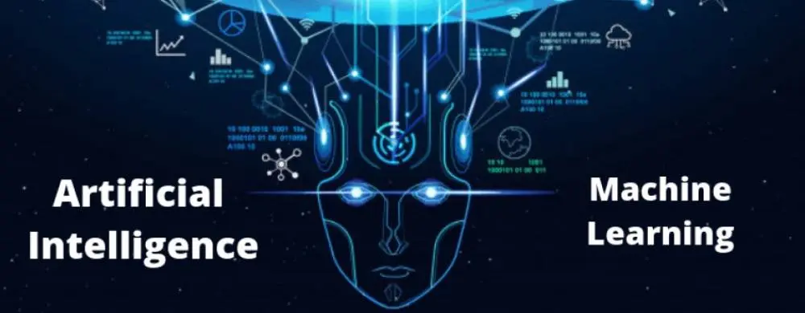

  

---

## 🧠 About Me

I'm a **Computer Science Engineering student at VIT Chennai**, specializing in **Artificial Intelligence & Robotics**.

I'm fascinated by how intelligent systems can **learn, reason, adapt and interact with the world**.

My interests are evolving around:

**Artificial Intelligence · Machine Learning · Generative AI · Agentic AI · Robotics**

I enjoy experimenting with algorithms and emerging technologies, understanding how they work, and discovering what I can build with them.

🌱 Currently in my **exploring phase** — strengthening my AI/ML foundations while diving deeper into **Generative AI and Agentic AI**.

---

# 🔭 What I'm Exploring

<table width="100%">
<tr>

<td width="50%" valign="top">

### 🧠 Machine Learning

Understanding how machines learn patterns from data and make predictions.

 

`ML Models` · `Feature Engineering`

`Classification` · `Anomaly Detection`

`Model Evaluation`

</td>

<td width="50%" valign="top">

### ✨ Generative AI

Exploring how generative models and LLMs are changing the way we interact with software and information.

 

`LLMs` · `Prompt Engineering`

`Generative Models` · `AI Applications`

</td>

</tr>

<tr>

<td width="50%" valign="top">

### 🕸️ Agentic AI

Curious about AI systems that can move beyond answering questions to **reason, plan, use tools and accomplish tasks**.

 

`AI Agents` · `Tool Use`

`Planning` · `Reasoning`

`Autonomous Workflows`

</td>

<td width="50%" valign="top">

### 🦾 Intelligent Robotics

Interested in bringing intelligence from software into the physical world.

 

`Robotics` · `Sensors`

`Embedded Systems` · `Automation`

`Drones`

</td>

</tr>
</table>

---

## ⚡ My AI Journey

 

&nbsp;→&nbsp;

&nbsp;→&nbsp;

&nbsp;→&nbsp;

  

From understanding algorithms → learning from data → exploring generative intelligence → discovering autonomous AI systems

---

# 🎨 Technologies I Work With

### 💻 Programming

  

### 🌐 Development

  

### 🤖 Machine Learning & Data

  

### 🦾 Robotics & Hardware

  

  

### 🧰 Tools & Platforms

---

# 🌱 Currently Learning

### Generative AI & Agentic AI

I'm continuously strengthening my **Machine Learning and AI fundamentals** while exploring newer approaches in **Generative AI and Agentic AI**.

I'm particularly curious about how AI systems can evolve from simply producing an answer to being able to:

 

&nbsp;→&nbsp;

&nbsp;→&nbsp;

&nbsp;→&nbsp;

&nbsp;→&nbsp;

---

# 💭 Things That Fascinate Me

<table width="100%">
<tr>

<td align="center" width="20%">
<h2>🧠</h2>
<b>Learning</b>
 
How machines learn
</td>

<td align="center" width="20%">
<h2>🔬</h2>
<b>Experimenting</b>
 
Learning by building
</td>

<td align="center" width="20%">
<h2>✨</h2>
<b>Generative AI</b>
 
How AI can create
</td>

<td align="center" width="20%">
<h2>🕸️</h2>
<b>AI Agents</b>
 
How AI can act
</td>

<td align="center" width="20%">
<h2>🦾</h2>
<b>Robotics</b>
 
AI in the physical world
</td>

</tr>
</table>

---

# 🌌 Where My Curiosity Is Taking Me

 

  

Exploring the intersection of <b>learning, reasoning, generation, action and automation.</b>

---

# 🌐 Let's Connect

 

  

### ✨ Curious. Experimental. Always exploring what's next in AI.

 

